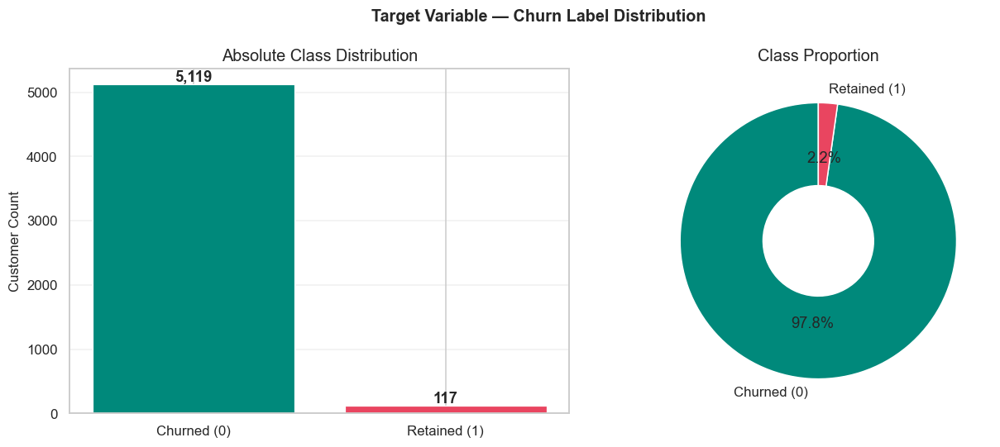
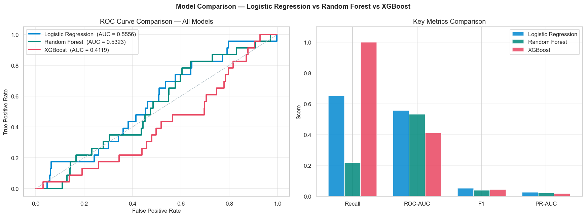

# Olist Retention Prediction

A production-style machine learning project for predicting customer retention in the Olist e-commerce ecosystem. The repository combines SQL-based feature engineering, exploratory analysis, and model benchmarking to identify customers most likely to churn and support targeted retention campaigns.



## Project Overview

This project focuses on building a practical retention-risk scoring workflow using:

- SQL feature engineering from the Olist relational dataset
- Python-based EDA and preprocessing
- Classification models for churn/retention prediction
- Business-oriented evaluation using recall, ROC-AUC, and F1-score

## Why this project matters

Retention is one of the most valuable business levers in e-commerce. Even a small improvement in customer retention can generate substantial revenue gains through repeat purchases, better customer lifetime value, and more efficient campaign targeting.

## Key Highlights

- End-to-end churn/retention prediction pipeline
- SQL-driven feature generation with a 365-day snapshot window
- Model comparison across Logistic Regression, Random Forest, and XGBoost
- Visual outputs stored in the `outputs/` folder for easy inspection and presentation

## Repository Structure

```text
.
├── data/
│   ├── processed/          # Engineered customer feature dataset
│   └── raw/                # Original Olist SQL dump
├── notebook/
│   └── olist_retention_prediction.ipynb
├── outputs/
│   ├── eda/                # Exploratory charts
│   ├── model_comparison/   # Model benchmark visuals
│   ├── roc_curves/         # ROC / PR visualizations
│   └── confusion_matrices/ # Confusion matrices
├── sql/
│   ├── feature_engineering.sql
│   └── SCHEMA_NOTES.md
└── temp_cell_40.txt
```

## Data & SQL Pipeline

The SQL pipeline in `sql/feature_engineering.sql` creates a customer-level feature table using:

- payment aggregation
- review aggregation
- product and order behavior summaries
- retention labels based on future purchase activity

This produces the final feature file used in the notebook:

- `data/processed/customer_features.csv`

## Model Insights

The notebook compares multiple models and saves visual artifacts for interpretation and reporting.



## How to Run

1. Install dependencies:
   `pip install pandas numpy matplotlib seaborn scikit-learn xgboost imbalanced-learn nbformat nbclient`
2. Open and run the notebook in `notebook/olist_retention_prediction.ipynb` using Jupyter or VS Code.
3. If you want to re-generate the visual outputs, execute the notebook cells in order.

## Output Artifacts

The main output directories include:

- `outputs/eda/` — retention distributions, RFM patterns, quality comparison
- `outputs/model_comparison/` — evaluation charts and metric comparisons
- `outputs/roc_curves/` — ROC and precision-recall visualizations
- `outputs/confusion_matrices/` — model error diagnostics

## Author


### Divyansh Dhadhich

Aspiring Data Scientist & Machine Learning Engineer focused on building practical AI and ML solutions using Python, SQL, Machine Learning, Deep Learning, and future Generative AI technologies.

## GitHub Repository Summary

This repository is a complete, presentation-ready retention prediction project built for GitHub upload and portfolio sharing. It showcases real-world data science workflow design, SQL feature engineering, machine learning experimentation, and clear visual storytelling for stakeholders.
